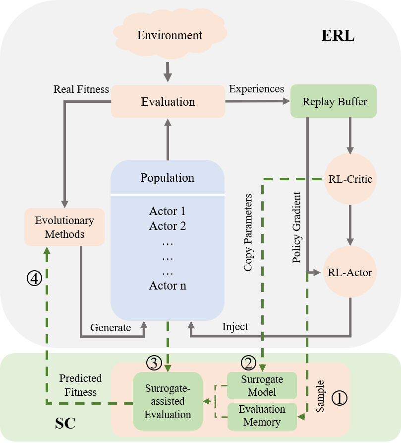

# Surrogate-assisted Evolutionary Reinforcement Learning
Code for the Information Sciences paper [A surrogate-assisted controller for expensive evolutionary reinforcement learning](https://www.sciencedirect.com/science/article/abs/pii/S0020025522012658).



## Abstract

The integration of Reinforcement Learning (RL) and Evolutionary Algorithms (EAs) aims at simultaneously exploiting the sample efficiency as well as the diversity and robustness of the two paradigms. Recently, hybrid learning frameworks based on this principle have achieved great success in robot control tasks. However, in these methods, policies from the genetic population are evaluated via interactions with the real environments, severely restricting their applicability when such interactions are prohibitively costly. In this work, we propose Surrogate-assisted Controller (SC), a generic module that can be applied on top of existing hybrid frameworks to alleviate the computational burden of expensive fitness evaluation. The key to our approach is to leverage the critic network that is implemented in existing hybrid frameworks as a novel surrogate model, making it possible to estimate the fitness of individuals without environmental interactions. In addition, two model management strategies with the elite protection mechanism are introduced in SC to control the workflow, leading to a fast and stable optimization process. In the empirical studies, we combine SC with two state-of-the-art evolutionary reinforcement learning approaches to highlight its functionality and effectiveness. Experiments on six challenging continuous control benchmarks from the OpenAI Gym platform show that SC can not only significantly reduce the cost of interaction with the environment, but also bring better sample efficiency and dramatically boost the learning progress of the original hybrid framework.

## Usage

**Requirements**

[Mujoco200](https://www.roboti.us/download.html) or its [higher version](https://github.com/deepmind/mujoco/releases)

mujoco-py==2.0.2.8

python >= 3.6.9

fastrand==1.3.0

gym==0.18.0

numpy==1.19.5

scipy==1.5.4

torch==1.8.1+cu111

### Surrogate-assisted ERL with Generation-based Control
Args
```
'--env': Environment Choices: (HalfCheetah-v2) (Ant-v2) (Reacher-v2) (Walker2d-v2) (Swimmer-v2) (Hopper-v2)', default='Hopper-v2'
'--seed': Random seed, default=1
'--surate': Probability of using surrogate-assisted evaluation, default=0.6
'--deviceid': GPU device ID, default=1
```

Example
``` shell
python SERL-G.py --env="Walker2d-v2" --seed=0 --device=3 --surate=0.6
```

### Surrogate-assisted ERL with Individual-based Control
Args
```
'--env': Environment Choices: (HalfCheetah-v2) (Ant-v2) (Reacher-v2) (Walker2d-v2) (Swimmer-v2) (Hopper-v2)', default='Hopper-v2'
'--seed': Random seed, default=1
'--alpha': Control factor of the candidate population size, default=1.0
'--deviceid': GPU device ID, default=1
```

Example
``` shell
python SERL-I.py --env="Hopper-v2" --seed=0 --device=1 --alpha=1.0
```

## Citation

```
@article{wang2022surrogate,
  title={A surrogate-assisted controller for expensive evolutionary reinforcement learning},
  author={Wang, Yuxing and Zhang, Tiantian and Chang, Yongzhe and Wang, Xueqian and Liang, Bin and Yuan, Bo},
  journal={Information Sciences},
  volume={616},
  pages={539--557},
  year={2022},
  publisher={Elsevier}
}
```
